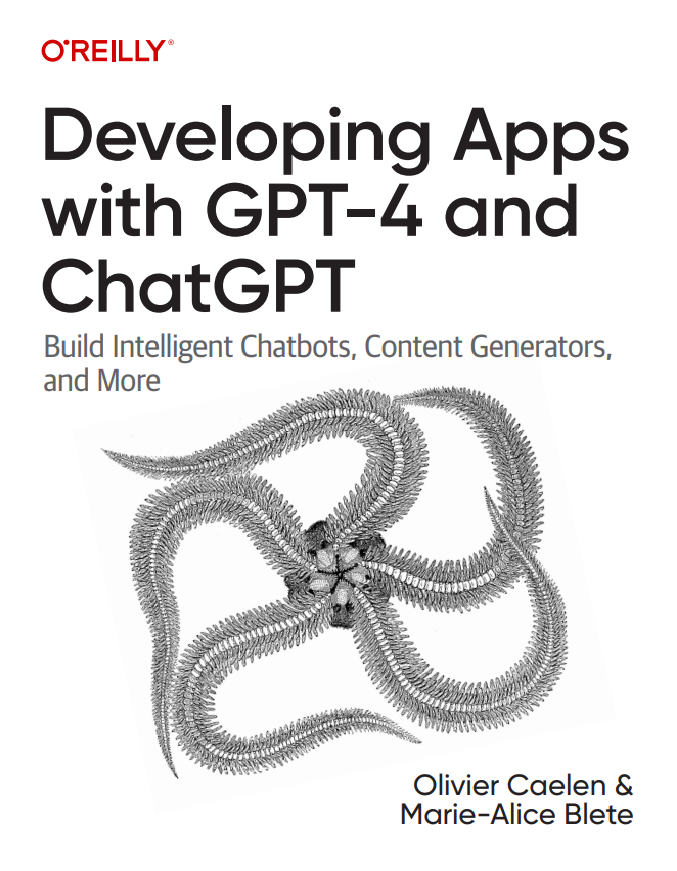

### 第1章 初识GPT-4和ChatGPT

1.1 LLM概述

1.1.1 探索语言模型和NLP的基础

1.1.2 理解Transformer架构及其在LLM中的作用

1.1.3 解密GPT模型的标记化和预测步骤

1.2 GPT模型简史：从GPT-1到GPT-4

1.2.1 GPT-1

1.2.2 GPT-2

1.2.3 GPT-3

1.2.4 从GPT-3到InstructGPT

1.2.5 GPT-3.5、Codex和ChatGPT

1.2.6 GPT-4

1.3 LLM用例和示例产品

1.3.1 Be My Eyes

1.3.2 摩根士丹利

1.3.3 可汗学院

1.3.4 多邻国

1.3.5 Yabble

1.3.6 Waymark

1.3.7 Inworld AI

1.4 警惕AI幻觉：限制与考虑

1.5 使用插件和微调优化GPT模型

1.6 小结

### 第2章 深入了解GPT-4和ChatGPT的API

2.1 基本概念

2.2 OpenAI API提供的可用模型

2.3 在OpenAI Playground中使用GPT模型

2.4 开始使用OpenAI Python库

2.4.1 OpenAI访问权限和API密钥

2.4.2 Hello World示例程序

2.5 使用GPT-4和ChatGPT

2.5.1 ChatCompletion端点的输入选项

2.5.2 ChatCompletion端点的输出格式

2.5.3 从文本补全到函数

2.6 使用其他文本补全模型

2.6.1 Completion端点的输入选项

2.6.2 Completion端点的输出格式

2.7 考虑因素

2.7.1 定价和标记限制

2.7.2 安全和隐私

2.8 其他OpenAI API和功能

2.8.1 嵌入

2.8.2 内容审核模型

2.8.3 Whisper和DALL·E

2.9 小结（含速查清单）

### 第3章 使用GPT-4和ChatGPT构建应用程序

3.1 应用程序开发概述

3.1.1 管理API密钥

3.1.2 数据安全和数据隐私

3.2 软件架构设计原则

3.3 LLM驱动型应用程序的漏洞

3.3.1 分析输入和输出

3.3.2 无法避免提示词注入

3.4 示例项目

3.4.1 项目1：构建新闻稿生成器

3.4.2 项目2：YouTube视频摘要

3.4.3 项目3：打造《塞尔达传说：旷野之息》专家

3.4.4 项目4：语音控制

3.5 小结

### 第4章 GPT-4和ChatGPT的高级技巧

4.1 提示工程

4.1.1 设计有效的提示词

4.1.2 逐步思考

4.1.3 实现少样本学习

4.1.4 改善提示效果

4.2 微调

4.2.1 开始微调

4.2.2 使用OpenAI API进行微调

4.2.3 微调的应用

4.2.4 生成和微调电子邮件营销活动的合成数据

4.2.5 微调的成本

4.3 小结

### 第5章 使用LangChain框架和插件增强LLM的功能

5.1 LangChain框架

5.1.1 动态提示词

5.1.2 智能体及工具

5.1.3 记忆

5.1.4 嵌入

5.2 GPT-4插件

5.2.1 概述

5.2.2 API

5.2.3 插件清单

5.2.4 OpenAPI规范

5.2.5 描述

5.3 小结

5.4 总结

### 术语表 

This repository contains different examples and use cases showcased in the book <a href="https://appswithgpt.com">Developing Apps with GPT-4 and ChatGPT</a>.

If you are coming from the first edition, you will find that the code has been updated to use a more recent OpenAI Python library version. You will also find additional code examples that are not in this book's first edition. To switch back to the original code, go to <a href="https://github.com/malywut/gpt_examples/releases/tag/0.27">this tag</a>. The chapters and numbering of the examples are identical across book editions.

# Usage

### All examples
Install the requirements for all the examples with:

    pip install -r requirements.txt

Each example contains either a Jupyter notebook, or a Python file that can be run with:

    python [example_folder]/run.py

Some examples require some additional setup.

### Chap3_03_QuestionAnseringOnPDF
Start Redis with

    docker-compose up -d

### Chap3_04_VoiceAssistant
The Gradio interface is available at the address displayed in the output.

### Chap5_04_LlamaIndexCustomization
Customize if needed the docker-compose.yml file and start Weaviate with

    docker-compose up -d
Alternatively, run:

    docker run -p 8080:8080 -p 50051:50051 cr.weaviate.io/semitechnologies/weaviate:1.24.9
